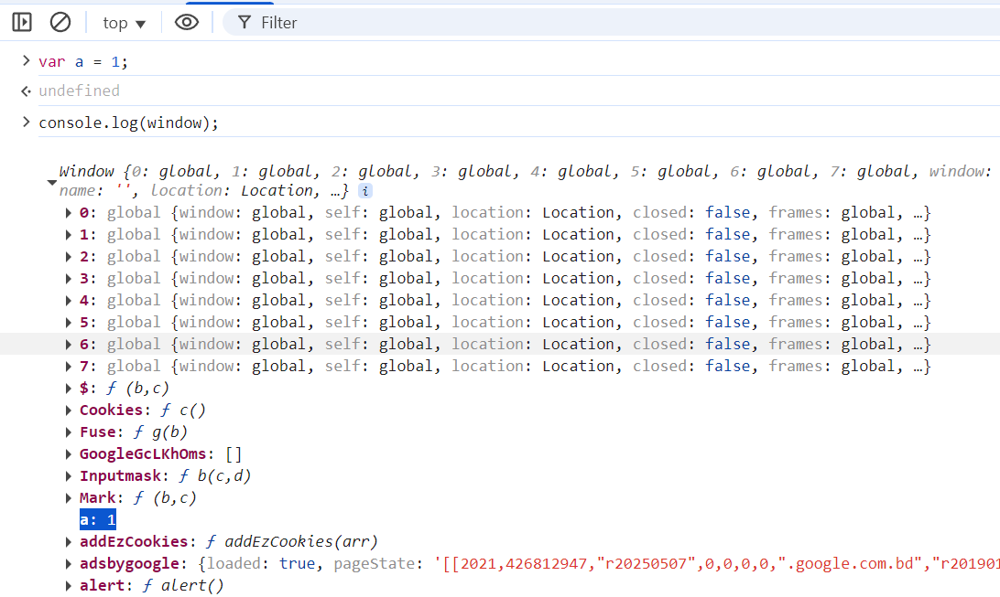

# Modules in Node

## Common Js

This is the default module system for node js. Here each .js file is considered as a module.  
For example
```shell
- Animal.js
- Flower.js
```
Here, Animal is a module and Flower is another module.

## window vs global

We know, node js is a runtime for javascript. It allows us to write server side code in javascript and run it outside the browser.  
So, as we are not running the code in the browser we can not access the `window` object.  
In nodeJs the object that works in the top level global scope is called `global`.  

In javascript the top level scope is window/global scoped.  
For example if we declare a variable 
```js
var a = 1;
console.log(window);
console.log(window.a);   //1
```
This will print the window object and the variable `a` will be a property of the window object.

<figure>
  
  <figcaption>Fig 01: window object having a var variable</figcaption>
</figure>

But in nodeJs if we declare a variable
```js 
var a = 1;
console.log(global.a);   //undefined
```

This will happen because nodeJs is by default a module system. Where each file is considered as a module.
So, the variable `a` is not a property of the global object, and we can not access it using `global.a`.
To access the variable `a` we need to attach it to the global object.
```js
global.a = 1;
console.log(global.a);   //1
```
## export and import in common js
In common js we can export a module using `module.exports` and import it using `require()`.

### export a module

```js
//math.js
const add = (a, b) => a + b;
const sub = (a, b) => a - b;

module.exports.add = add;
module.exports.sub = sub;
```

First we need to understand what is `module` and `exports`.
- module is a special built in object in nodeJs which represents the current module.
- exports is a property of the module object which is used to export the module.

```js
//app.js
console.log(module);
```
Output
```js
{
  id: '.',
  path: 'C:\\Users\\cefalo\\Documents\\nodejs\\codes\\test',
  exports: {},
  filename: 'C:\\Users\\cefalo\\Documents\\nodejs\\codes\\test\\app.js',
  loaded: false,
  children: [],
  paths: [
    'C:\\Users\\cefalo\\Documents\\nodejs\\codes\\test\\node_modules',
    'C:\\Users\\cefalo\\Documents\\nodejs\\codes\\node_modules',
    'C:\\Users\\cefalo\\Documents\\nodejs\\node_modules',
    'C:\\Users\\cefalo\\Documents\\node_modules',
    'C:\\Users\\cefalo\\node_modules',
    'C:\\Users\\node_modules',
    'C:\\node_modules'
  ],
  [Symbol(kIsMainSymbol)]: true,
  [Symbol(kIsCachedByESMLoader)]: false,
  [Symbol(kFormat)]: 'commonjs',
  [Symbol(kIsExecuting)]: true
}
```
Here we can see the `exports` property is an empty object.
So, when we do `module.exports.add = add;` we are adding a property `add` to the exports object.

So, after exporting the module from `math.js` the module object will look like this
```js
{
  ...
  exports: {
    add: [Function: add],
    sub: [Function: sub]
  },
    ...
}
```

### Other ways to export a module
We can also export a module using `exports` object.
```js
//math.js
const add = (a, b) => a + b;
const sub = (a, b) => a - b;
exports.add = add;
exports.sub = sub;
```
This is the shorthand way of exporting a module which is equivalent to `module.exports.add = add;` and `module.exports.sub = sub;`.
We can also export a module using `module.exports` object.
```js
//math.js
const add = (a, b) => a + b;
const sub = (a, b) => a - b;
module.exports = {
  add,
  sub
};
```
Here, we are explicitly assigning an object to the `module.exports` object. this will override the default `exports` object and we can access the module using `require()` function.  

So far we only exported functions from the module and treating the module.exports as an object. But we can also export a class or an array or any other data type.
```js
//math.js
module.exports = "Hello World";
```
Here we are exporting a string from the module. So, when we import the module using `require()` function, it will return the string "Hello World".
```js
//app.js
const message = require('./math.js');
console.log(message); //Hello World
```
Here, if we run the `app.js` file, it will print "Hello World".
```shell
node app.js
Hello World
```

## import a module

To import a module we use `require()` function.
```js
//app.js
const math = require('./math.js');
console.log(math.add(1, 2)); //3
console.log(math.sub(2, 1)); //1
```
Here we are importing the `math.js` module and using the `add` and `sub` functions from it.

One thing to note here, When we use `require()` function, it executes the module we are imporiting and gives us the `exports` object.
If we call require multiple times, it will not execute the module again. It will just return the `exports` object.
Why? 
Because nodeJs caches the module after the first call of the require() function.

We can also use destructuring to import the module.
```js
//app.js
const { add, sub } = require('./math.js');
console.log(add(1, 2)); //3
console.log(sub(2, 1)); //1
```

## Circular dependency
Circular dependency is when two or more modules depend on each other.
For example, if we have two modules `a.js` and `b.js` and both are importing each other.
```js
//a.js
const b = require('./b.js');
console.log(b);
//b.js
const a = require('./a.js');
console.log(a);
```
When we run `a.js`, it will throw an error.
```shell
Error: Cannot find module './b.js'
```
This is because when we import `b.js` in `a.js`, it will try to execute `b.js` first.
But `b.js` is also trying to import `a.js`, so it will throw an error.
To solve this problem we can use `exports` object to export the module.
```js
//a.js
const b = require('./b.js');
console.log(b);
exports.a = 'a';
//b.js
const a = require('./a.js');
console.log(a);
exports.b = 'b';
```
Now when we run `a.js`, it will not throw an error.
```shell
{ b: 'b' }
```

Note: Modern javascript are using another module system called ES Modules. Which we will discuss in the next article.